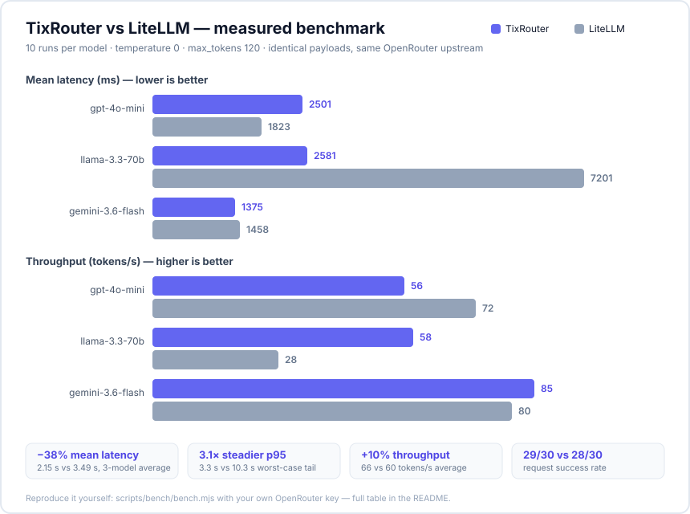

<p align="center">
  
</p>

<h1 align="center">TixRouter</h1>

<p align="center">
  <strong>Self-hosted AI gateway with a brain. One endpoint, 1200+ models, free tiers, and routing that gets smarter with every request.</strong><br/>
  The open-source alternative to OpenRouter / 9Router / LiteLLM that runs on <em>your</em> machine.
</p>

<p align="center">
  
  = 22" />
  
  
  
  
</p>

---

## Why TixRouter

Every AI tool wants a different endpoint, a different key, a different bill. TixRouter collapses all of it into **one OpenAI-compatible endpoint on your own hardware** — with your keys, your logs, your rules. And unlike a dumb proxy, it **learns**: every response feeds outcome stats, cache-affinity signals, and (optionally) a shadow arena that A/B-tests challenger models against your live traffic.

```
Claude Code · Cline · Codex · dsh · any OpenAI SDK
                 │
                 │  http://localhost:3000/v1  (one virtual key: tix-live-…)
                 ▼
          ┌────────────────────────────────┐
          │           TixRouter            │
          │  failover · pools · cache      │
          │  cascade-verifier · shadow     │
          │  arena · outcome routing       │
          └────────────────────────────────┘
                 │
    ┌────────────┼──────────────┬─────────────────┐
    ▼            ▼              ▼                 ▼
 OpenAI      Anthropic      DeepSeek         free tiers
 Gemini      Groq           Mistral          (dsfree · mfree · zen)
 Ollama      57+ more       …                no API key needed
```

## 📊 Measured benchmark: TixRouter vs LiteLLM

Same VPS, same OpenRouter upstream key, identical payloads (`temperature 0`, `max_tokens 120`), 10 timed runs per model after 1 warmup. Reproduce it yourself with [`scripts/bench/bench.mjs`](scripts/bench/bench.mjs) — numbers below are the real output, not marketing.

<p align="center">
  
</p>

| Model | Router | Success | Latency mean | p50 | p95 | tok/s |
|---|---|---|---|---|---|---|
| gpt-4o-mini | **TixRouter** | 10/10 | 2501 ms | 2764 ms | 3707 ms | 56 |
| gpt-4o-mini | LiteLLM | 10/10 | **1823 ms** | 2015 ms | **3080 ms** | **72** |
| llama-3.3-70b | **TixRouter** | 10/10 | **2581 ms** | **2938 ms** | **4745 ms** | **58** |
| llama-3.3-70b | LiteLLM | 10/10 | 7201 ms | 5118 ms | 26025 ms | 28 |
| gemini-3.6-flash | **TixRouter** | **9/10** | **1375 ms** | **1359 ms** | **1536 ms** | **85** |
| gemini-3.6-flash | LiteLLM | 8/10 | 1458 ms | 1440 ms | 1770 ms | 80 |

**3-model averages:** TixRouter **2.15 s mean latency vs 3.49 s** (−38%) · p95 tail **3.3 s vs 10.3 s** · **66 vs 60 tok/s** · **29/30 vs 28/30 success**. LiteLLM wins on gpt-4o-mini latency — we publish it anyway, because a benchmark you can't trust is worth nothing. The big differentiator is tail behavior: LiteLLM's worst llama-3.3-70b run took **26 s**, TixRouter's worst was 4.7 s.

## 🆚 How TixRouter compares

| | OpenRouter / 9Router | LiteLLM | **TixRouter** |
|---|---|---|---|
| Hosting | Their cloud | Self-hosted | **Self-hosted, one Docker command** |
| API keys | They manage | Bring your own | BYO + OAuth flows + **built-in free tiers** |
| Cost | Their margin on every token | Free software | **Free software, direct to providers** |
| Privacy | Requests hit their servers | Local | **Local — SQLite on your disk** |
| Shadow Arena (traffic-mirrored model A/B tests) | ✗ | ✗ | **✓ built in** |
| Cascade-with-Verifier (draft → verify → escalate) | ✗ | ✗ | **✓ built in** |
| Outcome-feedback routing (learns from retries/failures) | ✗ | ✗ | **✓ built in** |
| Prefix-cache affinity | ✗ | ✗ | **✓ built in** |
| Free-tier engines with auto re-login & pools | ✗ | ✗ | **✓ DeepSeek, Mistral, Zen** |
| 1200+ model catalog with pricing & context limits | ✓ | ✓ | **✓ local, cached from models.dev** |
| dsh / DeepSeek-Harness readiness (`x-tixrouter-*` headers, optional bearer) | ✗ | ✗ | **✓** |
| Playground, analytics, quota planner in the box | ✓ (hosted) | ✗ | **✓ self-hosted dashboard** |

## ✨ Highlights

- **One endpoint, 57+ providers, 1200+ models** — OpenAI, Anthropic, Gemini, Groq, DeepSeek, Mistral, Ollama, and many more behind a single `/v1` API with virtual keys (`tix-live-…`), quotas, and per-key usage tracking.
- **Smart routing that improves itself**
  - *Outcome-feedback routing* — every response is scored; models with proven success float to the top of the failover order, flaky ones sink. Kill switch included.
  - *Prefix-cache affinity* — requests route to the provider that already holds your prompt's prefix cache: up to 10× cheaper on cached tokens.
  - *Cascade-with-Verifier* — free draft model answers, a cheap verifier checks it, hard questions escalate to the premium model automatically (FrugalGPT, productionized).
- **Shadow Arena** — mirror a sample of live traffic to a challenger model, judge both answers, promote winners. A/B-test models with zero user impact and zero extra latency. Unique among gateways.
- **Built-in free tiers, zero keys**
  - `dsfree/*` — DeepSeek (V3, R1, V4-flash, V4-pro) via device login: email+password, vision upload, automatic 401 re-login, **multi-account pool** with cooldown rotation.
  - `mfree/mistral-large` — Mistral Le Chat anonymous access, streaming, web search.
  - `zen/*` — OpenCode Zen free models.
- **Failover cascade** — seed rules route `dsfree → mfree → zen` (and back) on 429/5xx. Custom rules with wildcards and priorities in the Combo page.
- **Response cache** — identical requests served from memory for 60s. One toggle.
- **Failure webhook** — POST a JSON alert to Discord/Telegram/anything when a model's whole chain dies.
- **Savings tracker** — the dashboard shows how much list-price money your free-tier traffic saved you.
- **Token saver** — compress tool outputs and prompts before they hit the provider (34 translator test cases), with a dashboard toggle.
- **Admin dashboard** — analytics with time series, playground with model compare, routing-health page, log viewer with full drill-down, provider health, key quotas, Ctrl+K command palette.
- **dsh-ready** — `x-tixrouter-*` response headers, model metadata (`context_window`, `max_output_tokens`) on `/v1/models`, optional bearer auth for harness environments, plus a [dsh plugin scaffold](integrations/dsh/README.md).
- **Cloudflare tunnel built in** — expose your gateway without port forwarding.

## 🚀 Quick start

### 1. Run it

```bash
git clone https://github.com/rynaqrtz/TixRouter.git
cd TixRouter
pnpm install
pnpm build
pnpm --filter api start
```

Or with Docker:

```bash
docker run -d -p 3000:3000 -v tixrouter-data:/data ghcr.io/rynaqrtz/tixrouter:latest
```

The gateway is now at `http://localhost:3000/v1`, dashboard at `http://localhost:3000`. Data (SQLite, WAL mode) lives in `~/.tixrouter/` — or `/data` in Docker.

### 2. Connect a tool

Point any OpenAI-compatible tool at your gateway:

| Tool | Base URL | Key |
|---|---|---|
| Claude Code | `http://localhost:3000` | your `tix-live-…` key |
| Codex CLI | `http://localhost:3000/v1` | your `tix-live-…` key |
| dsh / DeepSeek Harness | `http://localhost:3000/v1` | optional |
| Cline / any SDK | `http://localhost:3000/v1` | your `tix-live-…` key |

The dashboard's **CLI Tools** page generates copy-paste configs for each tool.

### 3. Use a free model right now

```bash
curl http://localhost:3000/v1/chat/completions \
  -H "Content-Type: application/json" \
  -d '{
    "model": "dsfree/deepseek-v3",
    "messages": [{"role": "user", "content": "Hello!"}]
  }'
```

If the DeepSeek connection is configured, this just works — and if it's rate-limited, the request automatically lands on `mfree/mistral-large`.

### 4. Reproduce the benchmark

```bash
TIX_KEY=tix-live-… node scripts/bench/bench.mjs openai/gpt-4o-mini
TIX_KEY=tix-live-… node scripts/bench/bench.mjs meta-llama/llama-3.3-70b-instruct
TIX_KEY=tix-live-… node scripts/bench/bench.mjs google/gemini-3.6-flash
```

Point the second router (LiteLLM) at the same upstream key for an apples-to-apples run on your own hardware.

## 🔧 Configuration

Manage everything from the dashboard (Providers, Settings, Combo, Keys):

| What | Where |
|---|---|
| Add a provider (API key / OAuth / free tier) | Dashboard → Providers |
| DeepSeek free pool: `email:pass;email2:pass2` in the key field | Dashboard → Providers |
| Toggle failover cascade / cache / webhook | Settings → Gateway → Server Features |
| Smart routing: outcome stats, cache affinity, shadow arena | Settings → Gateway + Routing page |
| Cascade-with-Verifier (draft / verifier models) | Settings → Gateway |
| Custom fallback rules (wildcards, priority) | Dashboard → Combo |
| Virtual keys + quotas | Dashboard → Keys |
| Playground & model compare | Dashboard → Playground |
| Expose via Cloudflare tunnel | Settings → Tunnel |

Environment variables (see `.env.example`): `PORT`, `TIXROUTER_DATA_DIR`, `DATABASE_PATH`, and friends.

## 📦 Project structure

```
TixRouter/
├── apps/
│   ├── api/        Hono 4 gateway + admin API (node:sqlite, Zod)
│   └── web/        React 19 dashboard (TanStack Router/Query, Tailwind v4)
├── integrations/
│   └── dsh/        DeepSeek Harness plugin scaffold
└── packages/
    ├── types/        Zod schemas — the wire contract
    ├── constants/    provider catalog, versions
    ├── db/           all SQLite queries (parameterized)
    ├── executors/    one class per provider + free-tier engines
    ├── pricing/      cost estimation from models.dev data
    ├── providers/    executor registry
    └── translator/   payload/stream translation, token saver
```

Architecture law: `routes → controllers → logic → services/packages`. Packages never import apps. Details in [AGENTS.md](AGENTS.md).

## 🧪 Development

```bash
pnpm install
pnpm build                 # turbo, cached
cd apps/api && pnpm test   # node:test via tsx, 180+ tests
cd apps/web && pnpm lint   # eslint
```

Per-package verification only — never run the whole monorepo suite at once (see AGENTS.md).

## 🗺️ Roadmap

- [x] Multi-provider gateway with virtual keys
- [x] DeepSeek free engine (login, vision, pool)
- [x] Mistral free engine
- [x] Free-tier failover cascade
- [x] Savings tracker
- [x] Response cache
- [x] Failure webhook
- [x] Shadow Arena (traffic-mirrored A/B testing)
- [x] Cascade-with-Verifier
- [x] Outcome-feedback routing
- [x] Prefix-cache affinity
- [x] Analytics, playground, routing-health dashboard
- [ ] Streaming / semantic cache
- [ ] More free-tier engines (community PRs welcome)

## 🤝 Contributing

PRs are welcome — read [AGENTS.md](AGENTS.md) first so your code matches the house rules (no comments, minimal diffs, stdlib first). By participating you agree to the [Code of Conduct](CODE_OF_CONDUCT.md).

## 📄 License

[MIT](LICENSE) — free as in speech, and as in the free tiers.

<p align="center">
  
</p>
